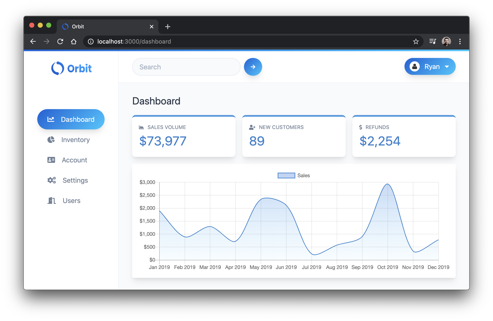

# Reactathon React Auth Workshop

<p>
  <a href="https://twitter.com/ryanchenkie" target="_blank">
    
  </a>
</p>

👋 Welcome to the repo for my React Auth workshop for Reactathon!

In general, this repo contains two things for each module in the workshop:

- A general explainer for what we'll be learning
- Instructions for completing the exercises

This repo only contains explainer and instructional content to compliment the live instruction during the workshop.

## Clone and Run the Demo App

The demo app we'll use in the workshop is called Orbit and you can find it [here](https://github.com/chenkie/orbit). The readme in the Orbit repo has instructions for getting up and running with it.

**[Clone and Download the Orbit App](https://github.com/chenkie/orbit)**



## The Exercise Branches

The Orbit repo is split up into branches to support the exercises we'll complete during the workshop. Each module (except for the first one) has a `start` and a `finish` branch.

When starting an excercise, checkout the `start` branch. For example:

```bash
git checkout 02-start
```

To see the solution, checkout the `finish` branch:

```bash
git checkout 02-finish
```
